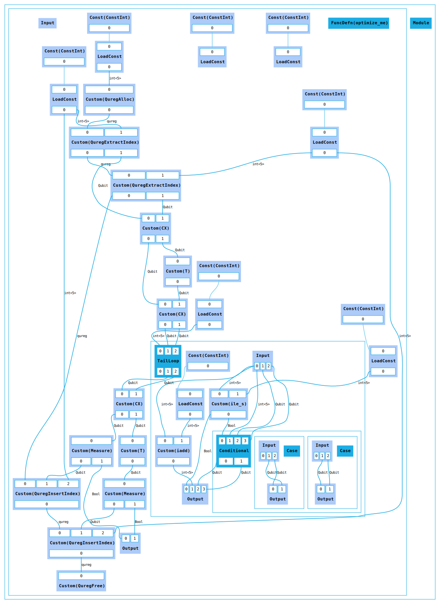
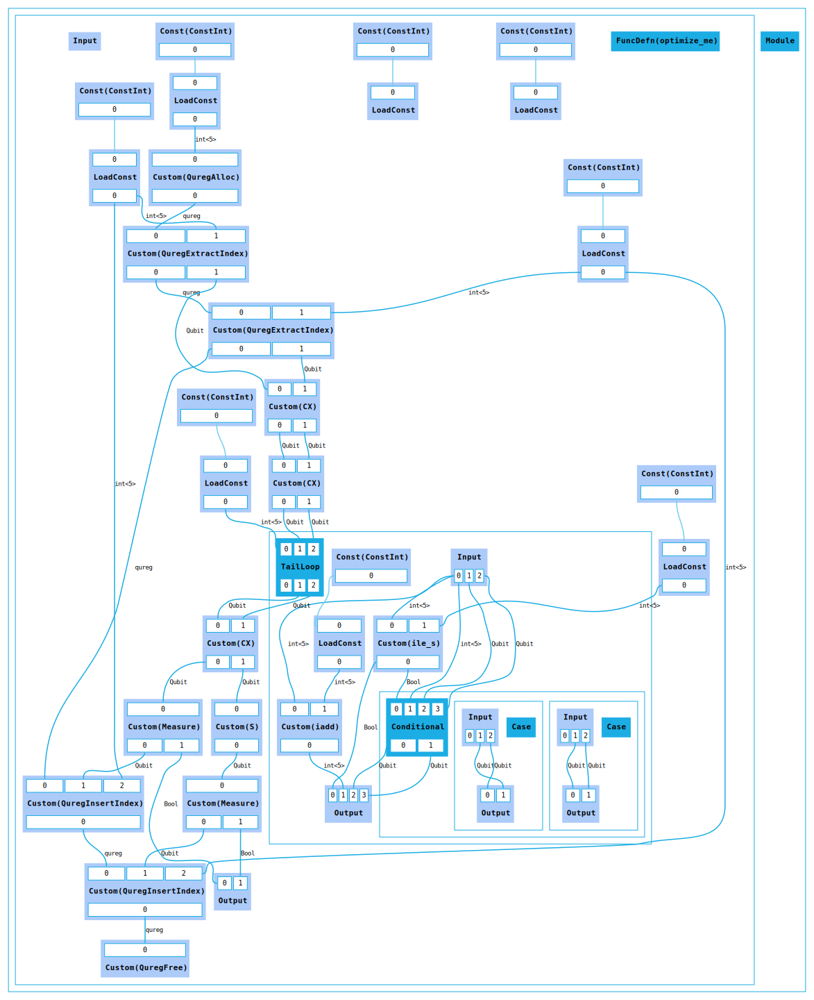

# Optimizing Catalyst IR with TKET

This example demonstrates the ability to optimize Catalyst IR through the *jeff* interchange format
and the TKET compiler. The optimization applied to the example is Matthew Amy's
[phase polynomial optimization across control flow](https://dl.acm.org/doi/10.1145/3704873).

The demo only involves one translation direction, since the reverse path has not been implemented
in Catalyst/HUGR yet.

The Catalyst converter prototype can be found [here](https://github.com/PennyLaneAI/catalyst-jeff).
The HUGR converter prototype can be found [here](https://github.com/CQCL/hugr-jeff).


### Catalyst MLIR

Source program admitting phase optimizations through CNOT and control flow:

```mlir
func.func @optimize_me() -> (i1, i1) {
    %c0 = arith.constant 0 : i64
    %c1 = arith.constant 0 : i64
    %c2 = arith.constant 2 : i64

    %r = quantum.alloc(%c2) : !quantum.reg
    %q1_0 = quantum.extract %r[%c0] : !quantum.reg -> !quantum.bit
    %q2_0 = quantum.extract %r[%c1] : !quantum.reg -> !quantum.bit

    %q1_1, %q2_1 = quantum.custom "CX"() %q1_0, %q2_0 : !quantum.bit, !quantum.bit
    %q2_2 = quantum.custom "T"() %q2_1 : !quantum.bit
    %q1_2, %q2_3 = quantum.custom "CX"() %q1_1, %q2_2 : !quantum.bit, !quantum.bit

    %lb = arith.constant 0 : index
    %up = arith.constant 3 : index
    %st = arith.constant 1 : index
    %q1_3, %q2_4 = scf.for %i = %lb to %up step %st iter_args(%q1__0 = %q1_2, %q2__0 = %q2_3) -> (!quantum.bit, !quantum.bit) {
        %q1__1, %q2__1 = quantum.custom "SWAP"() %q1__0, %q2__0 : !quantum.bit, !quantum.bit
        scf.yield %q1__1, %q2__1 : !quantum.bit, !quantum.bit
    }

    %q1_4, %q2_5 = quantum.custom "CX"() %q1_3, %q2_4 : !quantum.bit, !quantum.bit
    %q2_6 = quantum.custom "T"() %q2_5 : !quantum.bit

    %m1, %q1_5 = quantum.measure %q1_4 : i1, !quantum.bit
    %m2, %q2_7 = quantum.measure %q2_6 : i1, !quantum.bit

    %r1 = quantum.insert %r[%c0], %q1_5 : !quantum.reg, !quantum.bit
    %r2 = quantum.insert %r1[%c1], %q2_7 : !quantum.reg, !quantum.bit
    quantum.dealloc %r2 : !quantum.reg

    func.return %m1, %m2 : i1, i1
}
```

This input can be run through Catalyst's `opt` tool to generate the encoded IR:

```sh
quantum-opt catalyst_tket_opt.mlir --load-pass-plugin=catalyst-jeff.so --pass-pipeline="builtin.module(jeff-export)"
```

To obtain the human-readable (.txt) form:

```sh
capnp decode jeff.capnp Module < catalyst_tket_opt.jeff
```

### Catalyst *jeff*

The generated *jeff* is available as `catalyst_tket_opt.jeff` (encoded)
and `catalyst_tket_opt.txt` (decoded).


### HUGR



### Optimization

The two T gates are merged into an S gate:


